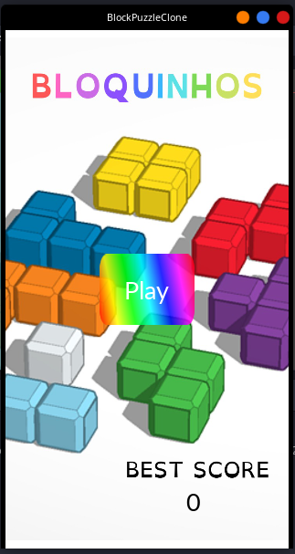
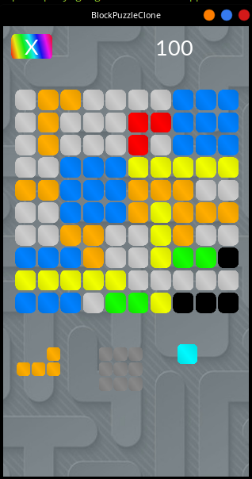
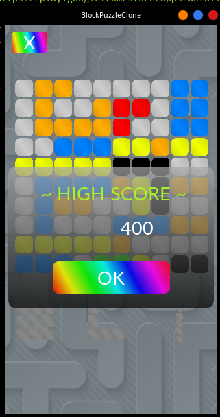

# BlockPuzzleClone

This is a [Block Puzzle](https://play.google.com/store/apps/details?id=game.puzzle.blockpuzzle) clone made in [Godot Engine](https://godotengine.org/).

The initial motivation for this copy was because this specific game (with this rules) was not available on Apple Store for iOS, and my girlfriend wanted to play on her IPhone

`¯\_(ツ)_/¯`

The title of the game is "Bloquinhos", which means "Little Blocks" in Portuguese, I didn't change it because she created this logo

## Screenshots

### Main Screen

### Game

### Game Over

